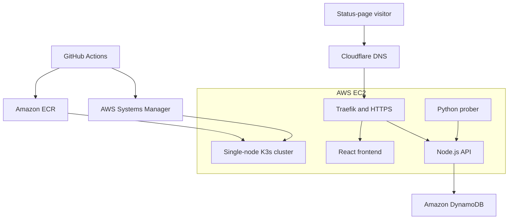

# Status Platform

A server-hosted status and uptime platform running on K3s in AWS.

Public dashboard: [https://status.travelregger.com](https://status.travelregger.com)

The development computer is used only for Git, Terraform, AWS CLI, and administration. No application component is hosted locally.

## Architecture



## Components

| Component | Technology | Purpose |
|---|---|---|
| Frontend | React, Vite, Nginx | Public status dashboard |
| API | Node.js, Express | Services, probe history, and incidents |
| Prober | Python | Runs health checks every 60 seconds |
| Orchestration | K3s | Runs the containers on EC2 |
| Ingress | Traefik | Routes public HTTP and HTTPS traffic |
| Certificates | cert-manager, Let's Encrypt | Issues and renews TLS certificates |
| Database | DynamoDB | Stores probe history and incidents |
| Container registry | Amazon ECR | Stores application images |
| Infrastructure | Terraform | Provisions AWS resources |
| CI/CD | GitHub Actions | Tests, builds, publishes, and deploys |
| Remote administration | AWS Systems Manager | Manages EC2 without SSH |

## Status behavior

- Checks run every 60 seconds.
- Requests time out after 5 seconds.
- HTTP 200–399 is successful.
- HTTP 400–599, connection errors, and timeouts are failures.
- Two consecutive failures mark a service down.
- Two consecutive successes mark a service operational.
- Results older than three minutes produce an unknown status.

The complete rules are in [docs/behavior.md](docs/behavior.md).

## Public API

| Method | Endpoint | Purpose |
|---|---|---|
| GET | `/api/health` | API health check |
| GET | `/api/services` | Current service states |
| GET | `/api/services/:serviceId/history` | Recent probe history |
| GET | `/api/incidents` | Public incident history |

Probe submission and incident-management routes require bearer-token authentication.

## Repository structure

```text
api/                 Node.js API
frontend/            React status dashboard
prober/              Python monitoring worker
terraform/           AWS infrastructure
k8s/                 Kubernetes manifests and deployment scripts
.github/workflows/   CI/CD pipelines
docs/                Behavior and operational documentation
```

## Deployment automation

| Change | Build workflow | Deployment workflow |
|---|---|---|
| API | API image | Deploy API |
| Prober | Prober image | Deploy prober |
| Frontend | Frontend image | Deploy frontend |
| TLS or ingress | Not required | Deploy platform configuration |

Application images use immutable tags containing the commit SHA and GitHub Actions run ID. GitHub authenticates to AWS through OpenID Connect instead of stored AWS access keys.

Deployments reach the private Kubernetes control plane through AWS Systems Manager. Kubernetes and SSH ports are not exposed publicly.

## Current scope

This environment uses one EC2 instance and one probe region. It is suitable for a portfolio or small deployment, but it is not highly available. An EC2 or Availability Zone failure can temporarily interrupt the platform until the node is restored.

See [docs/operations.md](docs/operations.md) for deployment, troubleshooting, recovery, and teardown procedures.